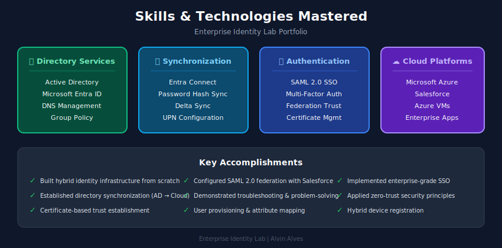
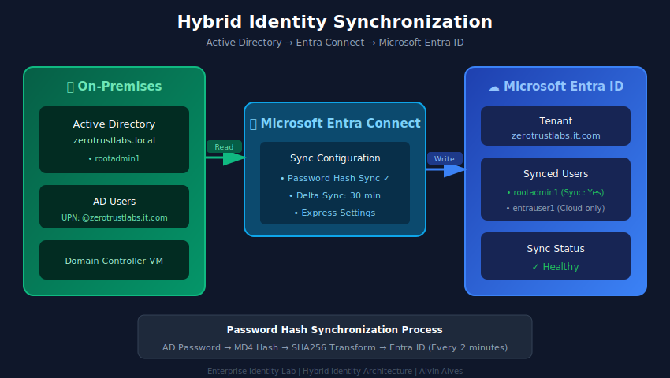
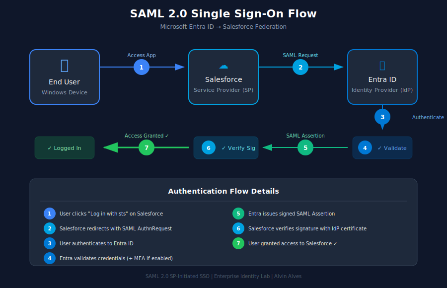

# Enterprise Identity Lab

> **Hybrid Identity & SSO Implementation** — A comprehensive lab demonstrating enterprise-grade identity management using Microsoft Active Directory, Entra ID, and SAML-based Single Sign-On with Salesforce.

---

## Overview

This lab walks through the end-to-end design and deployment of a hybrid enterprise identity environment. It covers on-premises Active Directory, synchronization to Microsoft Entra ID via Entra Connect, and federation to a SaaS application (Salesforce) using SAML 2.0.

---

## Lab Parts

| Part | Focus | Status |
| --- | --- | --- |
| [Part 1: On-Premises Foundation](docs/01-on-premises-foundation.md) | Active Directory, Group Policy, OU design | ✅ Complete |
| [Part 2: Hybrid Identity Bridge](docs/02-hybrid-identity-bridge.md) | Entra Connect, custom domain, hybrid sync | ✅ Complete |
| [Part 3: SSO Integration](docs/03-sso-integration.md) | SAML 2.0 federation with Salesforce | ✅ Complete |

---

## Architecture at a Glance

**On-Premises Foundation**

**Hybrid Identity Sync**

**SSO Federation Flow**

---

## Skills Demonstrated

- **Active Directory Domain Services** — domain controller deployment, OU structure design, security group management, GPO configuration
- **Hybrid Identity** — Microsoft Entra Connect installation, custom domain verification, attribute synchronization, password hash sync
- **Federation & SSO** — SAML 2.0 protocol, X.509 certificate-based trust, federation metadata exchange, claim/attribute mapping
- **Cloud Infrastructure** — Azure VM deployment, virtual networking, NSG configuration, public/private IP management
- **Identity Lifecycle** — user provisioning, role assignment, application access governance
- **Documentation** — multi-section technical writing, architecture diagramming, configuration evidence capture

---

## Tech Stack

---

## About

Built and documented by **Alvin Alves** — Identity & Access Management professional based in Brooklyn, NY.

- 🌐 Portfolio: [alvinalves.com](https://alvinalves.com)
- 💼 LinkedIn: [linkedin.com/in/alvin-alves](https://www.linkedin.com/in/alvin-alves/)
