# Part 1: On-Premises Foundation

> **Active Directory & Group Policy** — building the foundational on-prem directory that hybrid identity is built on.

## Objective

Build a production-like on-premises Active Directory environment hosted in Azure, demonstrating core enterprise identity management fundamentals — domain services deployment, user lifecycle management, organizational structure design, security group configuration, and workstation domain join operations.

## Technologies

- Microsoft Azure (IaaS)
- Active Directory Domain Services (AD DS)
- Windows Server 2019 Datacenter
- Windows 11 Enterprise
- Azure Virtual Network
- DNS
- RDP (Port 3389)

## Architecture

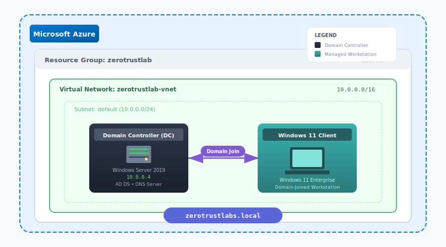

This lab simulates an on-premises enterprise environment hosted entirely in Azure:

- **Domain Controller (DC)** — Windows Server 2019 running AD DS and DNS, serving as the central identity authority
- **Windows 11 Client** — Domain-joined workstation representing an employee laptop
- **Virtual Network** — Isolated network segment (`10.0.0.0/16`) enabling secure communication between resources
- **Domain** — `zerotrustlabs.local`, the internal namespace for all identity operations

---

## Phase 1: Azure Infrastructure Setup

**What I built:** Resource group for logical organization and cost tracking, virtual network with proper IP addressing scheme, and a domain controller VM with cost-optimized configuration.

### 1.1 Resource Group Creation

Created `zerotrustlab` resource group in East US to contain all lab resources.

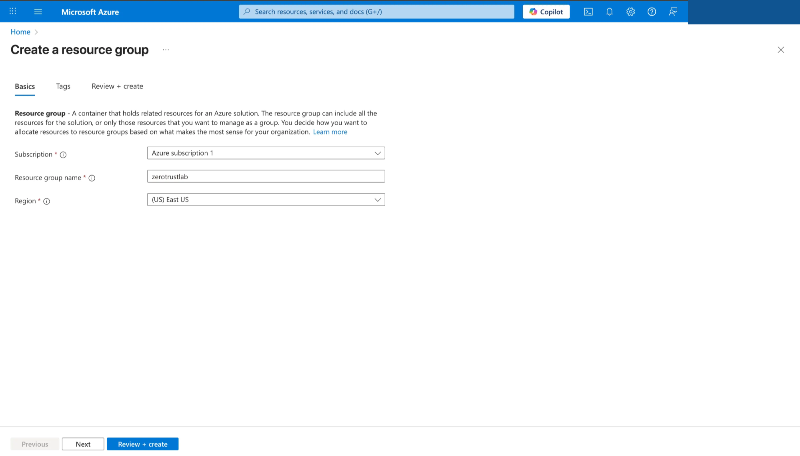

### 1.2 Virtual Network Configuration

Deployed virtual network with enterprise-appropriate address space.

| Setting | Value |
| --- | --- |
| VNet Name | `zerotrustlab-vnet` |
| Address Space | `10.0.0.0/16` (65,536 addresses) |
| Subnet | `default` — `10.0.0.0/24` (256 addresses) |
| Region | East US |

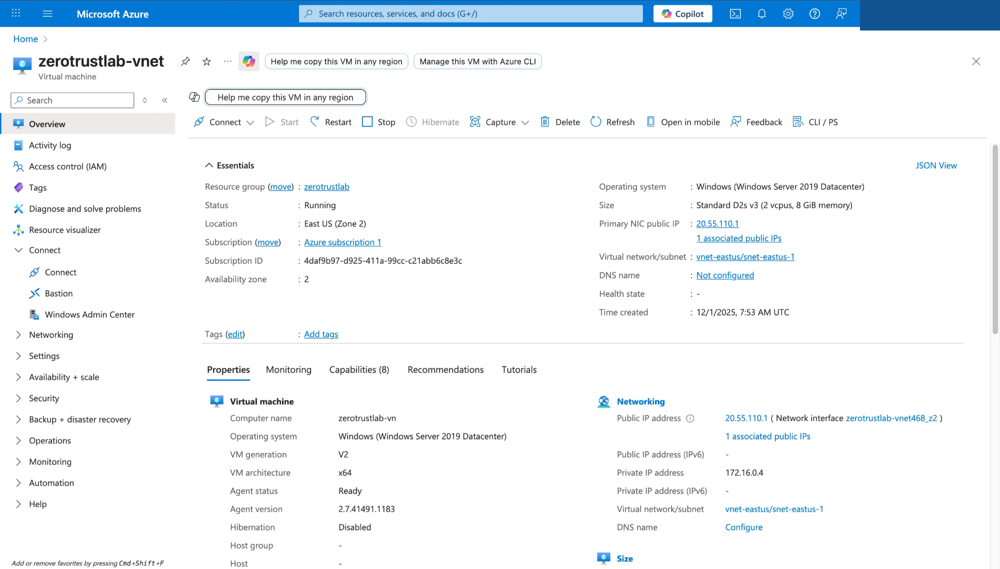

### 1.3 Domain Controller VM Deployment

Provisioned Windows Server 2019 VM to serve as the domain controller.

| Setting | Value |
| --- | --- |
| VM Name | `DomaineController` |
| OS | Windows Server 2019 Datacenter |
| Size | Standard D2s v3 (2 vCPUs, 8 GB RAM) |
| Region | East US |

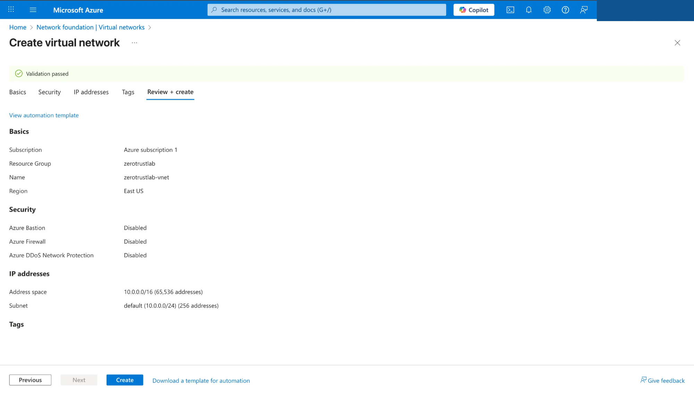

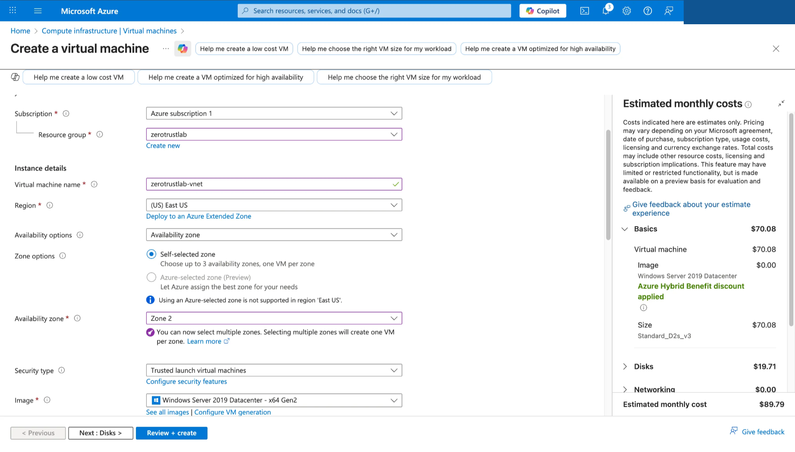

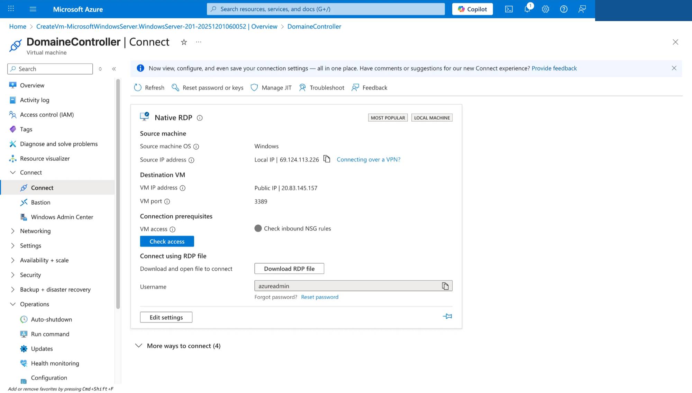

---

## Phase 2: Active Directory Domain Services

**What I built:** AD DS role installation and configuration, a new forest with custom domain name, and a DNS server integrated with Active Directory.

### 2.1 AD DS Role Installation

Installed Active Directory Domain Services role via Server Manager's *Add Roles and Features* wizard.

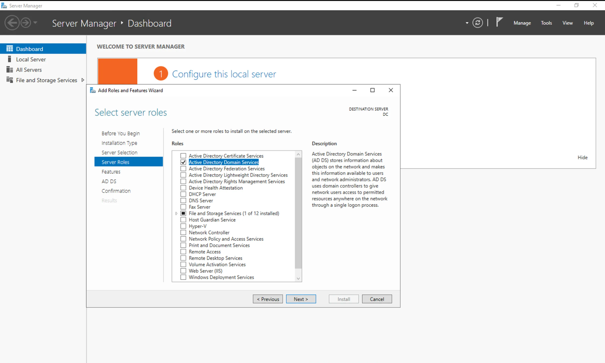

**Role Description:** AD DS stores information about objects on the network and makes this information available to users and network administrators. It uses domain controllers to give network users access to permitted resources through a single logon process.

### 2.2 DNS Server Configuration

Configured DNS to enable domain name resolution within the environment.

| DNS Setting | Value | Purpose |
| --- | --- | --- |
| Primary DNS | `127.0.0.1` | Loopback — DC handles internal queries |
| Alternate DNS | `8.8.8.8` | Google DNS — fallback for internet resolution |

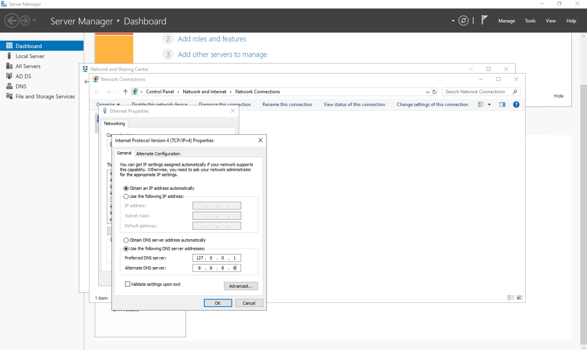

**Technical note:** The loopback configuration ensures all domain queries are resolved locally by the DC's integrated DNS, while Google DNS provides internet connectivity for external resources.

### 2.3 Forest & Domain Creation

Promoted the server to a domain controller and created a new Active Directory forest.

| Setting | Value |
| --- | --- |
| Deployment Operation | Add a new forest |
| Root Domain Name | `zerotrustlabs.local` |
| Forest Functional Level | Windows Server 2016 |
| Domain Functional Level | Windows Server 2016 |

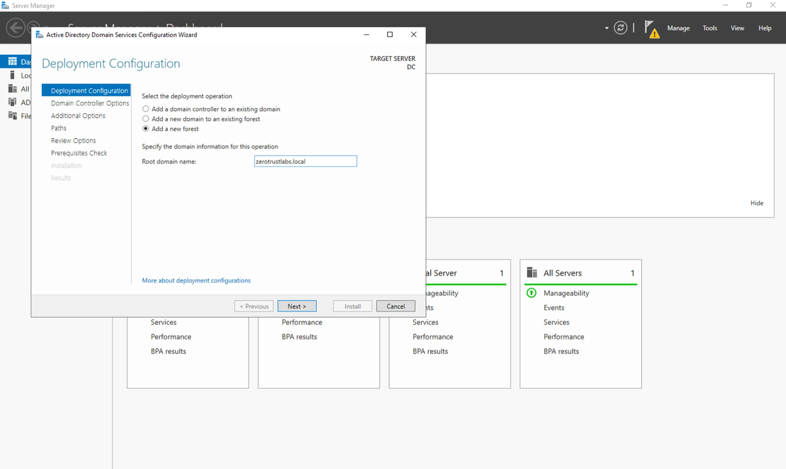

**Why `zerotrustlabs.local`?** The `.local` suffix indicates a non-routable internal domain, following Microsoft best practices for environments that will integrate with cloud services.

---

## Phase 3: Identity Structure Design

**What I built:** A custom Organizational Unit for user management, five user accounts representing different enterprise roles, and a security group implementing role-based access control (RBAC).

### 3.1 Organizational Unit Structure

Created a custom `OnPrem Users` OU to organize managed identities separately from built-in containers.

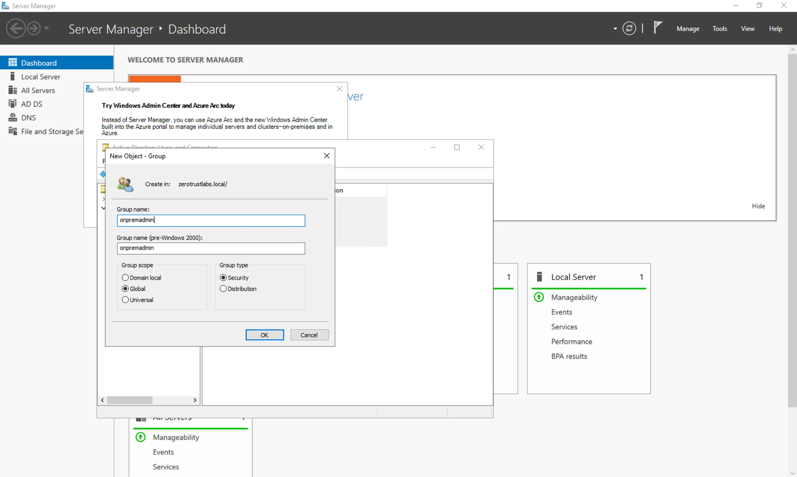

OU configuration:

- Accidental deletion protection enabled
- Serves as the target for user provisioning
- Prepares structure for Group Policy application (future enhancement)

### 3.2 User Account Provisioning

Created five user accounts representing different organizational roles:

| Username | Role | Description |
| --- | --- | --- |
| `accounting` | Finance User | Department-based service account |
| `helpdesk` | IT Support | First-line support personnel |
| `johndoe` | Standard Employee | Typical end user account |
| `manager` | Department Manager | Mid-level management |
| `rootadmin1` | Privileged Admin | Domain administration account |

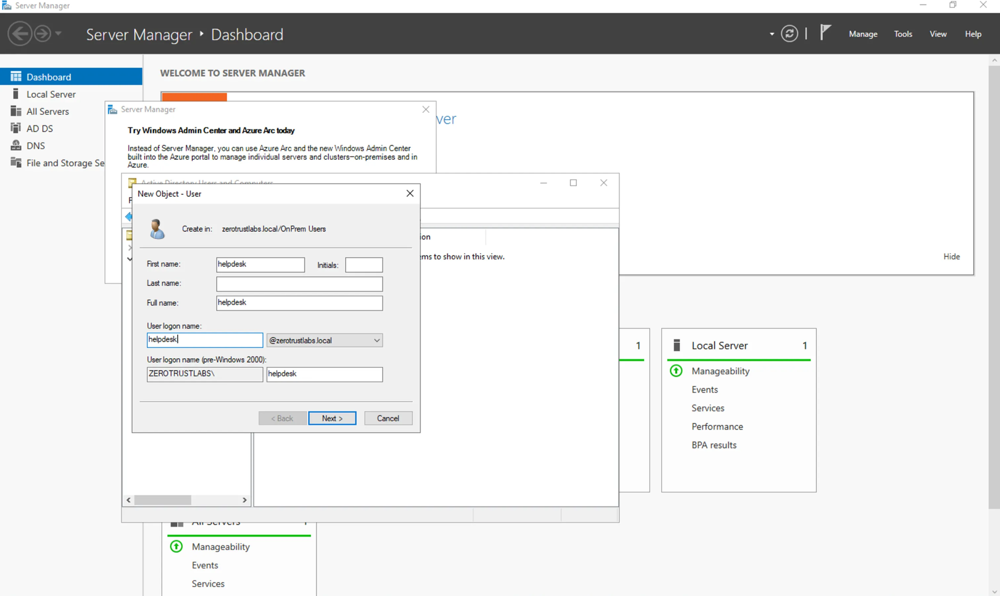

### 3.3 Security Group & RBAC Implementation

Implemented role-based access control using nested group membership:

```
rootadmin1 (User)
    └── Member of: onpremadmin (Security Group)
                        ├── Member of: Domain Admins
                        └── Member of: Enterprise Admins
```

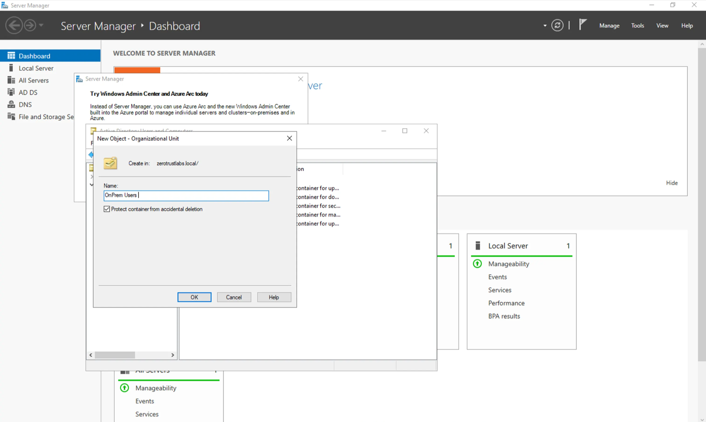

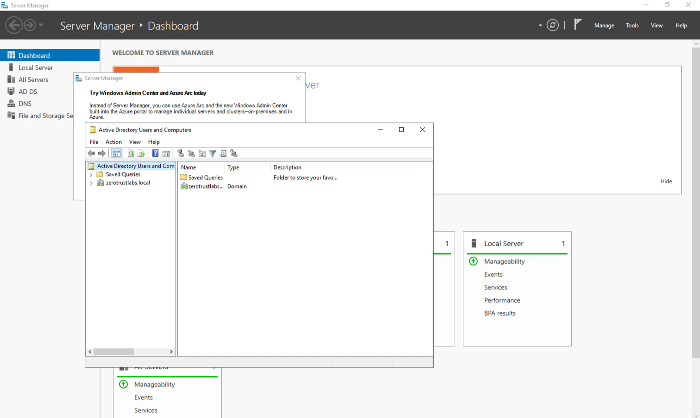

**RBAC pattern, explained:**

- Users are added to security groups (not directly to privileged roles)
- Security groups inherit permissions from built-in admin groups
- This pattern scales — add or remove users from the group without modifying role assignments
- Standard enterprise practice for privileged access management

---

## Phase 4: Windows 11 Client & Domain Join

**What I built:** A Windows 11 Enterprise workstation VM, network configuration pointing to the domain controller, a successful domain join operation, and remote desktop access for domain users.

### 4.1 Windows 11 Client VM Deployment

Created a Windows 11 Enterprise VM to simulate a managed employee workstation.

| Setting | Value |
| --- | --- |
| VM Name | `windows11client` |
| OS | Windows 11 Enterprise 23H2 |
| Size | Standard D2s v3 (2 vCPUs, 8 GB RAM) |
| Auto-Shutdown | 7:00 PM EST |

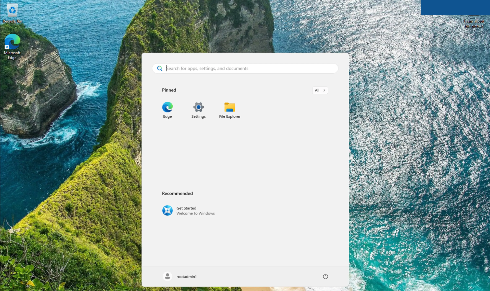

### 4.2 Client DNS Configuration

Configured the Windows 11 client to use the domain controller as its primary DNS server — a prerequisite for domain join.

| Setting | Value |
| --- | --- |
| Preferred DNS | `172.19.0.4` (Domain Controller) |
| Alternate DNS | `8.8.8.8` (Google DNS) |

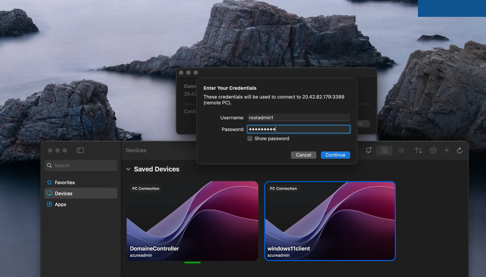

**Why this step matters:** Without pointing to the DC's DNS, the client cannot resolve `zerotrustlabs.local` and domain join fails. This is a common troubleshooting scenario in enterprise environments.

### 4.3 Domain Join Process

Joined the Windows 11 client to the `zerotrustlabs.local` domain using the privileged `rootadmin1` account.

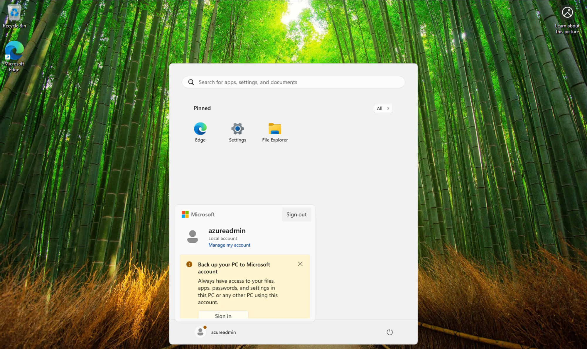

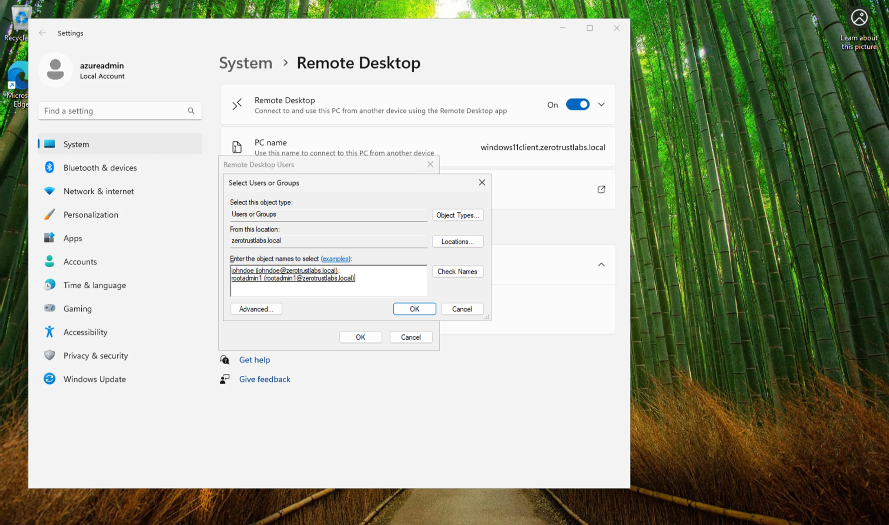

Process flow:

1. System Properties → Change domain/workgroup
2. Selected *Domain* and entered `zerotrustlabs.local`
3. Authenticated with `rootadmin1` (privileged account required)
4. Received confirmation: *Welcome to the zerotrustlabs.local domain*
5. Rebooted to apply domain membership

### 4.4 Domain User Login Verification

Successfully logged into the domain-joined workstation as `rootadmin1`, confirming end-to-end identity management.

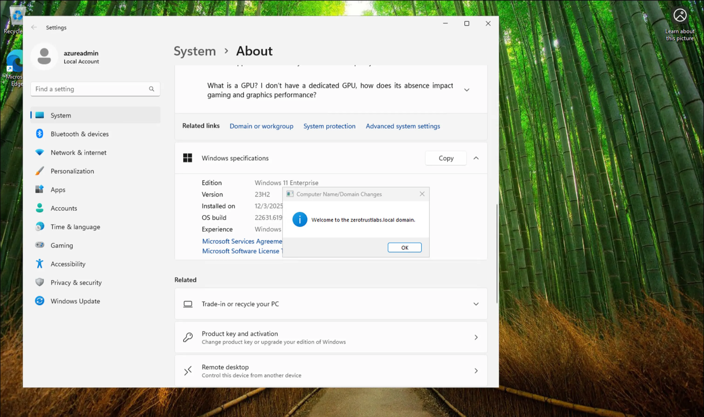

The Start menu shows `rootadmin1` as the logged-in user, confirming:

- ✅ Domain controller is functioning correctly
- ✅ DNS resolution is working
- ✅ User authentication succeeded against AD DS
- ✅ Workstation is properly managed

---

## Skills Demonstrated

| Skill Area | Demonstrated Capability |
| --- | --- |
| **Azure IaaS** | VM deployment, VNet configuration, resource group management |
| **Active Directory** | Forest creation, domain promotion, OU design |
| **Identity Management** | User provisioning, lifecycle workflow |
| **Access Control** | Security groups, nested group membership, RBAC |
| **DNS Administration** | Split DNS, client configuration, troubleshooting |
| **Workstation Management** | Domain join, RDP access control |
| **Cloud Economics** | Auto-shutdown, cost optimization awareness |

## Key Takeaways

**Why Active Directory still matters.** AD remains the foundation of identity management in most enterprises. Even organizations moving to cloud-first strategies typically maintain hybrid AD environments. This lab demonstrates core competencies required for any IAM role.

**Centralized identity.** All users and computers authenticate against a single directory, enabling consistent policy enforcement across the organization.

**Least privilege via groups.** Rather than assigning permissions directly to users, the `onpremadmin` group pattern shows how enterprises scale access management without creating security gaps.

**Hybrid-ready architecture.** The `zerotrustlabs.local` domain is intentionally structured to support cloud synchronization — setting the stage for Part 2's Entra Connect integration.

**Real-world troubleshooting.** Configuring client DNS, performing domain joins, and verifying authentication are daily tasks for IAM engineers. This lab mirrors production scenarios.

---

**Next:** [Part 2 — Hybrid Identity Bridge](02-hybrid-identity-bridge.md) → extending this on-prem AD to Microsoft Entra ID via Entra Connect.
